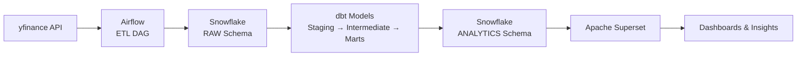

*(Airflow → Snowflake → dbt → Superset)*

## 📘 Overview
This lab implements a complete, production-oriented **ELT (Extract–Load–Transform) data pipeline** designed to automate daily stock analytics using modern data engineering tools.

The pipeline performs:

1. **Extraction** — Fetch daily stock data from Yahoo Finance (`yfinance`)
2. **Loading** — Store raw stock data in the **Snowflake RAW schema**
3. **Transformation** — Clean, structure, and enrich data using **dbt**
4. **Visualization** — Build analytic dashboards using **Apache Superset**

This lab demonstrates enterprise-level orchestration, warehousing, transformation modeling, and BI integration.

---

## 🧱 Architecture Diagram



---

## 📁 Repository Structure

```
.
├── dags/
│   ├── etl_stock_raw_dag.py       
│   └── dbt_run_dag.py            
├── dbt/
│   ├── dbt_project.yml
│   ├── profiles.yml
│   └── models/
│       ├── staging/
│       ├── intermediate/
│       └── marts/
├── requirements.txt
└── README.md
```

---

## 🔧 Prerequisites

- Python **3.10**  
- Snowflake account (with appropriate role/warehouse access)  
- Apache Airflow **2.9.x**  
- dbt-core + dbt-snowflake  
- Superset (recommended in a separate venv)  
- All secrets must be supplied via **environment variables**  

---

## 🚀 Setup & Installation

### **1. Clone the repository**
```bash
git clone <your-repo-url>
cd lab2-stock-pipeline
```

### **2. Create virtual environment**
```bash
python3 -m venv .venv
source .venv/bin/activate
```

### **3. Install Airflow with pinned constraints**
```bash
pip install "apache-airflow==2.9.3" --constraint \
  "https://raw.githubusercontent.com/apache/airflow/constraints-2.9.3/constraints-3.10.txt"
```

Then install project requirements:
```bash
pip install -r requirements.txt
```

---

## 🔐 Required Environment Variables

```
export SNOWFLAKE_ACCOUNT="<account>"
export SNOWFLAKE_USER="<user>"
export SNOWFLAKE_PASSWORD="<password>"
export SNOWFLAKE_ROLE="TRAINING_ROLE"
export SNOWFLAKE_WAREHOUSE="COMPUTE_WH"
export SNOWFLAKE_DATABASE="USER_DB"
export SNOWFLAKE_SCHEMA="RAW"

export DBT_PROFILES_DIR="$(pwd)/dbt"
export AIRFLOW_HOME="$(pwd)/.airflow"
```

---

## 🌀 Airflow Configuration

### **1. Initialize Airflow**
```bash
airflow db init
```

### **2. Create admin user**
```bash
airflow users create \
  --username admin \
  --firstname Admin \
  --lastname User \
  --role Admin \
  --email admin@example.com \
  --password admin
```

### **3. Start Airflow services**
```bash
airflow webserver --port 8080
airflow scheduler
```

### **4. Configure Connections**
Go to **Airflow UI → Admin → Connections → snowflake_default**

Configure:

- Account  
- User  
- Password  
- Warehouse  
- Database  
- Schema  
- Role  

### **5. Airflow Variables**
| Variable | Value |
|---------|--------|
| `snowflake_database` | USER_DB |
| `raw_schema` | RAW |
| `analytics_schema` | ANALYTICS |
| `snowflake_role` | TRAINING_ROLE |
| `stock_symbols` | ["AAPL","MSFT","GOOG"] |
| `start_date` | 2018-01-01 |

---

## 📡 DAGs

### **DAG 1 — `etl_stock_raw_dag`**
- Creates database, schema, and tables if missing  
- Pulls stock OHLCV data using `yfinance`  
- Loads into Snowflake RAW schema  

### **DAG 2 — `dbt_run_dag`**
- Runs `dbt run` to build:
  - staging views  
  - intermediate models (moving averages, RSI, returns)  
  - mart table **FCT_STOCK_ANALYTICS**  

---

## 🧱 dbt Layer

Run dbt manually:

```bash
cd dbt
dbt debug
dbt run
```

Validate in Snowflake:

```sql
SELECT COUNT(*) FROM RAW.STOCK_PRICES;

SELECT * 
FROM ANALYTICS.FCT_STOCK_ANALYTICS
ORDER BY DATE DESC
LIMIT 50;
```

---

## 📊 Superset Dashboard

### Setup Superset (separate venv recommended):

```bash
python3 -m venv superset-venv
source superset-venv/bin/activate
pip install apache-superset
superset fab create-admin
superset db upgrade
superset init
superset run -p 8088
```

### Connect Snowflake as a database  
### Create datasets:  

- `RAW.STOCK_PRICES`  
- `ANALYTICS.FCT_STOCK_ANALYTICS`  

### Build charts:

- Line chart — Close Price
- Moving Averages (MA20/MA50)
- RSI indicator
- Daily Returns (%)
- KPI: Latest Close Price

Combine into a unified **Stock Analytics Dashboard**.

---

## 📄 License  
Educational use for **DATA 226** course.

